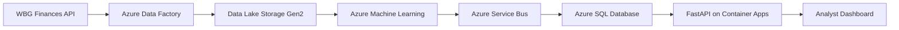
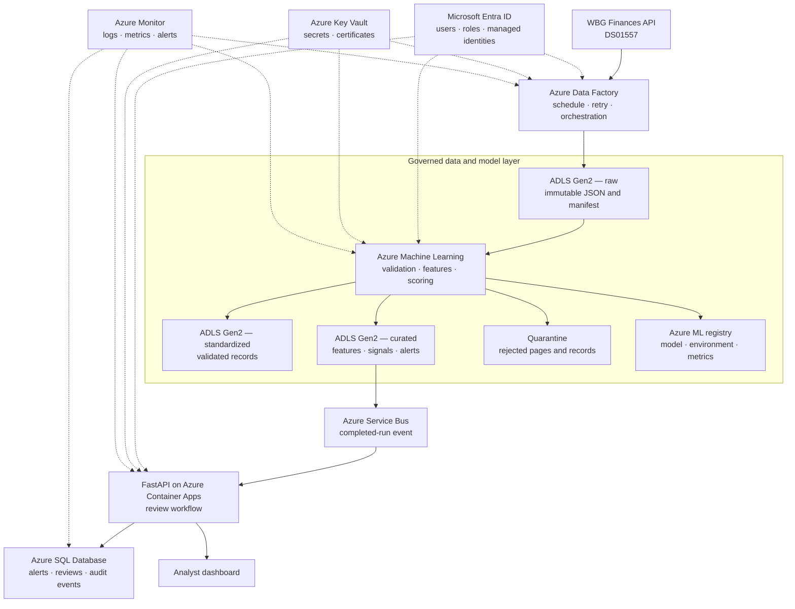
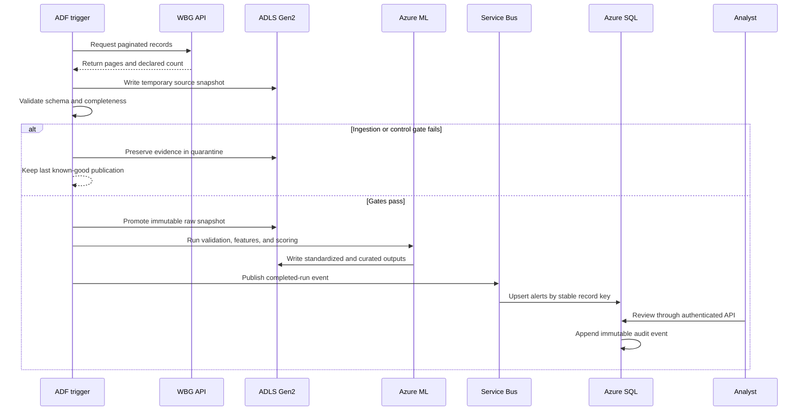

# IDA Financial Data Control Tower

An interpretable anomaly-detection prototype for World Bank IDA commitment and
gross-disbursement data. The system ingests official WBG Finances data, validates
financial controls, engineers time-series and composition features, applies
statistical and machine-learning detectors, and produces analyst-ready alerts.

## MVP question

How can a lightweight control layer detect missing, inconsistent, and unusual
financial records before they propagate into downstream reporting?

## Architecture and production pathway

The repository contains a working local implementation and a separately defined
Azure-oriented target architecture. The Azure services below describe a
productionization pathway; they are **not presented as a completed deployment**.

| Layer | Current implementation | Azure-oriented target |
|---|---|---|
| Ingestion and orchestration | Python pipeline | Azure Data Factory |
| Data storage | Versioned local files and pipeline artifacts | Azure Data Lake Storage Gen2 |
| Validation and anomaly detection | Python, statistical controls, and Isolation Forest | Azure Machine Learning batch jobs and model registry |
| Alert and review evidence | CSV artifacts and SQLite | Azure Service Bus and Azure SQL Database |
| Application services | Local FastAPI service and dashboard | FastAPI on Azure Container Apps and a hosted analyst dashboard |
| Security and observability | Local configuration and logs | Microsoft Entra ID, Azure Key Vault, and Azure Monitor |

### Executive architecture overview

This recruiter-facing view communicates the core production flow and the
human-in-the-loop control model at a glance.



Cross-cutting controls:

- **Microsoft Entra ID:** identity, authentication, and role-based access;
- **Azure Key Vault:** secrets, certificates, and connection protection; and
- **Azure Monitor:** pipeline, model, API, and application telemetry.

[Open the polished, editable architecture overview in Figma](https://www.figma.com/design/7Go7iFTzqqyFQpol5XzL1g)

### Detailed Azure reference architecture

The detailed view preserves the engineering decisions behind the overview:
immutable source evidence, separate raw and curated zones, controlled model
promotion, reliable alert publication, persistent review evidence, and
cross-cutting security and monitoring.



[Open the editable detailed reference architecture in FigJam](https://www.figma.com/board/U9QiUIPkNCJhbqL4DYXfQ5)

### End-to-end processing sequence



The local prototype remains independently runnable without Azure. Its Python
pipeline, FastAPI service, SQLite review workflow, and analyst dashboard serve as
the implemented reference for this target design.

The deployable target-state package is available in [`infra/`](infra/README.md).
The staged delivery, CI/CD, security, cost, evidence, and rollback plan is
documented in
[`docs/azure_productionization.md`](docs/azure_productionization.md).

## Official source

- Dataset: IDA Commitments and Disbursements — Country / Economy Summary
- WBG Finances dataset ID: `DS01557`
- Resource ID: `RS00964`
- Coverage: FY2014 onward, with annual history and recent quarterly observations
- Unit: USD millions
- License: CC BY 4.0

The analytical pipeline filters the source to IDA records. It does not use or
claim access to internal World Bank systems.

## Controls

1. **Structural:** required fields, data types, valid categories, unique grain.
2. **Financial:** non-negative amounts and component-to-total reconciliation.
3. **Statistical:** robust peer and historical deviations.
4. **Machine learning:** Isolation Forest over interpretable magnitude,
   composition, ratio, and change features.
5. **Explainability:** every alert includes severity, reason codes, evidence,
   and a recommended analyst action.

The complete assumptions, features, segmentation, scoring behavior, evaluation
evidence, limitations, and responsible-use requirements are documented in the
[`model card`](docs/model_card.md).

Snapshot-level ingestion, completeness, uniqueness, reconciliation, feature
availability, alert-composition, and remediation evidence is documented in the
[`data-quality report`](docs/data_quality_report.md).

## Financial calibration

- Annual and quarterly observations are modeled separately.
- Commitments and gross disbursements are modeled separately.
- Country records are separated from regional and institutional aggregates;
  only countries enter the current statistical and ML detectors.
- Disbursement-to-commitment ratios are suppressed when commitments are below
  USD 10 million, because a tiny denominator can create a misleadingly large
  ratio. This is a prototype calibration assumption, not WBG policy.
- ML-only alerts cannot be critical. Severity rises when independent detector
  families agree and the record is financially material.
- The analyst queue displays current, prior-period, and comparable prior-year
  amounts rather than presenting a score without financial context.

## Run

```bash
python -m src.pipeline
```

Outputs are written to `artifacts/` and cleaned data to `data/processed/`.

Key outputs:

- `artifacts/alert_signals.csv`: one row per detector signal.
- `artifacts/alerts.csv`: consolidated analyst queue, one row per source record.
- `artifacts/manual_review_sample.csv`: a stratified review sample.
- `artifacts/reviews.csv`: durable review decisions preserved across pipeline runs.
- `artifacts/review_summary.json`: review coverage and caveated rate estimates.
- `artifacts/run_summary.json`: run-level volumes and severity distribution.

## Analyst dashboard

Phase 1 adds a functional dashboard in `dashboard/`. It reads the actual pipeline
artifacts and supports:

- portfolio-level monitoring and severity summaries;
- a searchable, filterable, and sortable analyst alert queue;
- current-versus-prior financial comparisons;
- detector evidence, corroboration, and recommended actions;
- public-evidence review context; and
- model, evaluation, and review-quality monitoring.

After running the Python pipeline, synchronize its latest outputs:

```bash
bash scripts/sync-dashboard-data.sh
```

Run the dashboard locally:

```bash
cd dashboard
npm ci
npm run dev
```

The dashboard is an investigation interface. It does not autonomously classify
alerts as errors or replace review by an IDA financial-data specialist.

## Persistent analyst review

Phase 3 adds a FastAPI review service backed by SQLite for local development.
It enforces review-state transitions, records append-only audit events, and uses
optimistic version checks to prevent silent overwrites.

Run the full local workflow:

```bash
python3 -m venv .venv
source .venv/bin/activate
pip install -r requirements.txt
cd dashboard && npm install && cd ..
bash scripts/run-full-stack.sh
```

When the API is available, the investigation panel supports beginning, saving,
resolving, and reopening reviews. When it is unavailable, the dashboard remains
usable in read-only snapshot mode. See `docs/backend_review_workflow.md`.

Create the manual-review sample with:

```bash
python -m src.review
```

After entering review outcomes in the sample, persist them and summarize review
behavior:

```bash
python -m src.review --sync-sample --summarize
```

## Current validation

The controlled fault-injection harness tests five scenarios: missing amount,
broken reconciliation, negative component, duplicate grain, and an internally
reconciled historical spike. The spike must exercise both the statistical and ML
layers. Detection of these selected injections does not imply 100% real-world
accuracy.

The evaluation also runs the Isolation Forest across 0.5%, 1%, 2%, and 5%
contamination assumptions. It compares controlled-fault recall with ML and
consolidated queue volumes on untouched records. The current 1% operating point
remains provisional until enough human-reviewed outcomes exist to estimate
precision and false-positive behavior; the sensitivity table is not presented
as production accuracy. To avoid a saturated test in which every threshold
detects only an extreme fault, the calibration view separately reports recall
for reproducibly selected, internally reconciled historical records stressed by
5× and 10×.

The manual-review workflow estimates false-positive behavior on untouched alerts.
Rates remain suppressed until at least ten cases are resolved. The initial
critical-alert review is AI-assisted and based on public evidence; it is not a
substitute for validation by an IDA financial-data specialist.

## Independent-project disclaimer

This is an independent portfolio prototype using publicly available World Bank
data. It is not an official World Bank Group system and does not use internal WBG
infrastructure or non-public financial records.
