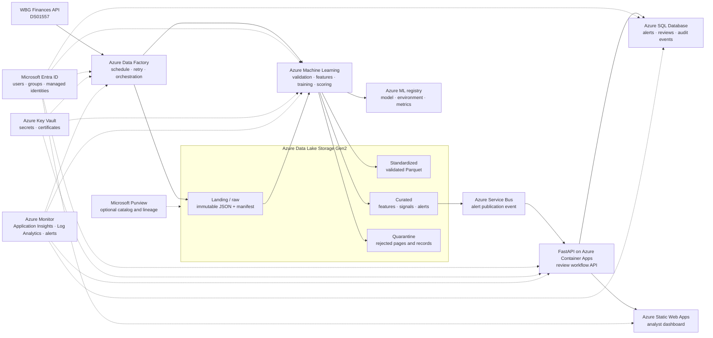

# Azure-oriented target architecture

> **Status:** target design only — not currently deployed on Azure  
> **Prototype owner:** Nicolaas Heru Dreandachrista  
> **Last updated:** 2026-07-26  
> **Current runtime:** local Python pipeline, SQLite review store, FastAPI API,
> and Vinext dashboard

## 1. Purpose

This document describes how the working local prototype could be productionized
on Microsoft Azure without changing its core control logic. The design is meant
to support scheduled financial-data ingestion, reproducible anomaly detection,
human review, auditability, and controlled model promotion.

It is not a representation of the World Bank Group's internal infrastructure.
The prototype uses only public WBG Finances data.

## 2. Architectural principles

1. **Preserve financial lineage.** Every alert must trace to an immutable source
   snapshot, standardized record, feature set, detector signal, and model run.
2. **Publish atomically.** A failed or incomplete run must not replace the last
   known-good dashboard snapshot.
3. **Keep ML advisory.** Rules retain precedence and analysts determine whether
   unusual activity is erroneous, legitimate, or still unresolved.
4. **Separate compute from evidence.** Re-running a model must not rewrite
   historical source snapshots, review decisions, or audit events.
5. **Use identity instead of embedded credentials.** Workloads authenticate with
   managed identities; people authenticate through Microsoft Entra ID.
6. **Design for rollback.** Application revisions, data publications, and model
   versions must be independently reversible.
7. **Scale only when justified.** The present workload does not require Spark.
   Azure Databricks is a future scale option, not a default dependency.

## 3. Target architecture



## 4. Responsibility of each service

| Service | Responsibility | Local equivalent | Why it is included |
|---|---|---|---|
| Azure Data Factory | Schedule ingestion, call the source API, enforce retries, coordinate validation/scoring, and publish only after all gates pass | `python -m src.pipeline` | Makes the batch repeatable, observable, and independent of a laptop |
| Azure Data Lake Storage Gen2 | Retain immutable source snapshots and versioned standardized/curated datasets | `data/raw`, `data/processed`, `artifacts` | Provides durable lineage and separates source evidence from derived outputs |
| Azure Machine Learning | Execute Python jobs, capture environments and metrics, register approved model versions, and run batch scoring | `src/features.py`, `src/detect.py`, `src/evaluate.py` | Adds reproducibility and model lifecycle governance without changing the algorithm |
| Azure SQL Database | Store operational alerts, review states, reviewer identity, optimistic versions, and append-only audit events | SQLite | Supports concurrent authenticated users and durable transactional writes |
| Azure Container Apps | Run the FastAPI review service as a versioned container that can scale independently | local Uvicorn process | Keeps API execution continuously available and supports revision rollback |
| Azure Static Web Apps | Publish the analyst dashboard and integrate Entra authentication | local development server | Gives reviewers a stable browser interface without bundling application compute |
| Microsoft Entra ID | Authenticate users and workloads; map groups to analyst, reviewer, administrator, and read-only roles | free-text reviewer field | Establishes attributable actions and least-privilege access |
| Azure Key Vault | Store secrets and certificates; workloads retrieve them through managed identity | local environment variables | Prevents credentials from entering source code or deployment configuration |
| Azure Monitor | Collect pipeline, application, infrastructure, and model-run telemetry | console output and local logs | Detects stale data, failures, latency, and abnormal run behavior |
| Azure Service Bus | Decouple successful alert publication from API/database processing and retain failed messages | direct file synchronization | Prevents a temporary downstream outage from forcing pipeline recomputation |
| Microsoft Purview | Optional enterprise catalog, classifications, ownership, and lineage | documentation only | Useful when the prototype expands to internal or multi-source data estates |

## 5. End-to-end processing sequence

```mermaid
sequenceDiagram
    participant T as ADF trigger
    participant S as WBG API
    participant L as ADLS Gen2
    participant M as Azure ML
    participant R as Model registry
    participant B as Service Bus
    participant Q as Azure SQL
    participant A as Analyst

    T->>S: Request paginated DS01557 records
    S-->>T: Pages + declared record count
    T->>L: Write temporary landing snapshot
    T->>T: Verify schema, page counts, and completeness
    alt ingestion fails
        T->>L: Move evidence to quarantine
        T-->>T: Preserve last known-good publication
    else ingestion succeeds
        T->>L: Atomically promote immutable raw snapshot
        T->>M: Start validation, feature, and scoring job
        M->>L: Write standardized data, features, signals, alerts
        M->>R: Log model version, environment, metrics, and data reference
        M-->>T: Return control-gate results
        alt gates pass
            T->>B: Publish completed-run event
            B->>Q: Upsert alerts by stable record_key
            A->>Q: Review through authenticated API
            Q->>Q: Append immutable audit event
        else gates fail
            T-->>T: Mark run failed; do not publish
        end
    end
```

## 6. Data-zone design

### Landing/raw

Immutable source evidence, partitioned by source and ingestion timestamp:

```text
landing/wbg-finances/ds01557/ingestion_date=YYYY-MM-DD/run_id=<uuid>/
  response.json
  manifest.json
```

The manifest records source URL, declared and received counts, retrieval
timestamps, page hashes, schema fingerprint, pipeline version, and run ID.

### Standardized

Validated records in columnar format:

```text
standardized/ida_commitments_disbursements/
  period_type=annual/category=commitments/
  period_type=annual/category=gross_disbursements/
  period_type=quarterly/category=commitments/
  period_type=quarterly/category=gross_disbursements/
```

Rejected records are written to quarantine with a reason code. They do not
silently disappear.

### Curated

Versioned analytical and application contracts:

```text
curated/features/run_id=<uuid>/
curated/detector_signals/run_id=<uuid>/
curated/alerts/run_id=<uuid>/
curated/run_summary/run_id=<uuid>/
```

The dashboard reads only a successfully promoted run. Historical runs remain
available for reconciliation and rollback.

## 7. Model lifecycle

### Training

The four existing model segments remain separate:

1. annual commitments;
2. annual gross disbursements;
3. quarterly commitments; and
4. quarterly gross disbursements.

Training is a versioned Azure ML command job. Each run records:

- immutable data snapshot URI and hash;
- Git commit;
- container/environment version;
- feature schema and transformations;
- segment-level record counts;
- estimator count, contamination assumption, and random state;
- fault-injection results and review-evidence status;
- candidate model artifact and evaluation report.

### Promotion gates

A candidate is registered but not promoted unless:

- ingestion and schema contracts pass;
- all deterministic financial controls execute;
- the controlled fault-injection suite passes its documented expectations;
- alert volume remains within an agreed tolerance or receives manual approval;
- feature schema matches the expected contract;
- the model card and run metadata are complete.

Production promotion should require approval by both a technical owner and a
financial-data owner. The current prototype cannot supply the latter and does
not claim production readiness.

### Scoring

Scheduled scoring is a batch job, not a real-time endpoint. IDA source updates do
not require millisecond inference, and batch execution is simpler to reconcile,
reproduce, and control. A batch endpoint can be introduced when orchestration
needs a stable invocation contract.

### Rollback

Rollback is performed by repointing the scoring job to:

- the preceding registered model version;
- its compatible environment;
- its expected feature schema; and
- the last known-good curated publication.

Review decisions and audit history are never rolled back with the model.

## 8. Application and review workflow

The FastAPI service runs on Azure Container Apps. Azure SQL contains:

- `alerts`: current operational alert state keyed by `record_key`;
- `reviews`: reviewer, outcome, confidence, notes, evidence, and version;
- `review_events`: append-only state-transition history;
- `pipeline_runs`: source, code, model, and publication references;
- `model_versions`: production and candidate metadata.

The API uses optimistic concurrency exactly as the local prototype does. A stale
client receives a conflict response rather than silently overwriting another
reviewer.

Suggested Entra groups:

| Group | Capabilities |
|---|---|
| `ida-control-readers` | View alerts, evidence, and run metadata |
| `ida-control-analysts` | Begin and update reviews |
| `ida-control-approvers` | Resolve/reopen alerts and approve model promotion |
| `ida-control-admins` | Operate pipelines and manage application configuration |

The application should record the authenticated Entra object ID and display name
for every write. Reviewer identity must not remain free text in production.

## 9. Security boundaries

- Use system-assigned managed identities for ADF, Azure ML jobs, and Container
  Apps wherever service support permits.
- Grant data-plane roles at the narrowest container, queue, vault, and database
  scope.
- Store secrets in Key Vault and reference them from Container Apps; do not
  duplicate secret values in source control.
- Enforce HTTPS, Entra authentication, and least-privilege application roles.
- Use private endpoints and restricted network access for ADLS, Azure SQL,
  Key Vault, and the Azure ML workspace in an institutional deployment.
- Encrypt data at rest using platform-managed keys initially; evaluate
  customer-managed keys only when policy requires them.
- Disable public blob access and apply retention/immutability policies to raw
  source and audit evidence where required.
- Scan application images and pin dependencies before promotion.

The public-data prototype has low data sensitivity, but the target design
assumes the same control tower could later process internal financial data.

## 10. Observability

### Pipeline metrics

- source response and retry count;
- declared versus received records;
- ingestion duration;
- rejected/quarantined records;
- time since last successful publication;
- stage status and rerun count.

### Data-quality metrics

- required-field failures;
- duplicate-grain count;
- reconciliation failures;
- record count and schema drift;
- feature null rate by segment;
- alert counts by detector, severity, category, and period type.

### Model metrics

- segment population;
- score distribution;
- percentage flagged;
- detector agreement rate;
- feature-distribution drift;
- evaluation harness results;
- analyst-confirmed issue, legitimate-exception, and false-positive rates once
  the minimum review threshold is met.

### Application metrics

- API availability, error rate, and latency;
- review write conflicts;
- unresolved critical-alert age;
- Service Bus active and dead-letter messages;
- database connection failures.

Azure Monitor alerts should route operational incidents separately from
financial anomalies. A pipeline failure is not itself an IDA financial alert.

## 11. Failure and recovery behavior

| Failure | Required behavior |
|---|---|
| API unavailable or throttled | Bounded retry; fail the run after limit; retain last good publication |
| Declared count changes during pagination | Reject snapshot and quarantine metadata |
| Partial or malformed snapshot | Never promote landing files to raw |
| Validation or scoring failure | Mark run failed and do not publish partial alerts |
| Alert publication unavailable | Retain message in Service Bus for retry/dead-letter inspection |
| Review database unavailable | Dashboard remains read-only; reject writes explicitly |
| Model regression | Revert model/environment version without changing review evidence |
| Application regression | Shift traffic to the previous Container Apps revision |

## 12. Why Azure ML instead of Databricks now

The current source contains 3,420 records and the model is lightweight. Azure
Machine Learning is the more proportionate default because the immediate
problem is experiment lineage, environment capture, model registration, and
controlled promotion—not distributed computation.

Azure Databricks becomes justified when:

- sources expand enough to require distributed Spark processing;
- streaming or large-scale Delta Lake workloads are introduced;
- feature engineering becomes the dominant computational workload; or
- the institution already operates a governed Databricks lakehouse.

At that point, Databricks can produce standardized and feature tables while
Azure ML or MLflow governs model artifacts. The dashboard and review API do not
need to change.

## 13. Proposed service objectives

These are design proposals, not WBG commitments:

| Objective | Proposed target |
|---|---|
| Data freshness | Successful publication within two hours of a scheduled source refresh |
| Pipeline success | At least 99% successful scheduled runs, excluding confirmed source outages |
| Review API availability | 99.5% monthly |
| Audit durability | No accepted review write without a corresponding audit event |
| Recovery point | Last successfully promoted source and alert publication |
| Recovery time | Restore the last known-good application/data publication within four hours |

Targets must be confirmed with financial-data owners before implementation.

## 14. Microsoft references

- [Azure Data Factory introduction](https://learn.microsoft.com/azure/data-factory/introduction)
- [Azure Data Lake Storage overview](https://learn.microsoft.com/azure/storage/blobs/data-lake-storage-introduction)
- [Azure Data Lake Storage access-control model](https://learn.microsoft.com/azure/storage/blobs/data-lake-storage-access-control-model)
- [Azure Machine Learning model management](https://learn.microsoft.com/azure/machine-learning/concept-model-management-and-deployment)
- [Azure Machine Learning model registration](https://learn.microsoft.com/azure/machine-learning/how-to-manage-models)
- [Azure Container Apps security](https://learn.microsoft.com/azure/container-apps/security)
- [Container Apps Key Vault references](https://learn.microsoft.com/azure/container-apps/manage-secrets)
- [Microsoft Entra authentication for Azure SQL](https://learn.microsoft.com/azure/azure-sql/database/authentication-aad-overview)
- [Azure Monitor overview](https://learn.microsoft.com/azure/azure-monitor/fundamentals/overview)
- [Application Insights and OpenTelemetry](https://learn.microsoft.com/azure/azure-monitor/app/app-insights-overview)
- [Azure Service Bus messaging](https://learn.microsoft.com/azure/service-bus-messaging/service-bus-messaging-overview)

