# Productionization plan

> This is an implementation roadmap for the Azure target architecture. It does
> not claim that the listed Azure resources currently exist.

## 1. Current baseline

The local prototype already demonstrates:

- public-API ingestion with retries and pagination integrity checks;
- schema, structural, financial, statistical, and ML controls;
- four segmented Isolation Forest models;
- deterministic run configuration and controlled fault injection;
- consolidated explainable alerts with materiality and corroboration;
- a FastAPI review workflow with optimistic concurrency and audit history;
- a dashboard for alert triage and model-governance evidence;
- automated Python and frontend contract tests.

Productionization should preserve these tested behaviors rather than rewrite the
application around cloud services.

## 2. Environment strategy

Use separate Azure resource groups and data boundaries:

| Environment | Purpose | Data |
|---|---|---|
| Local | Development and rapid testing | Public snapshot and local SQLite |
| Development | Integration testing and infrastructure iteration | Public/non-sensitive test data |
| Test | Release candidate, UAT, security, and recovery tests | Controlled test copy |
| Production | Scheduled pipeline and authorized analyst review | Approved operational data |

Models, application revisions, and data publications move forward independently.
No development identity should receive standing production write access.

## 3. Delivery phases

### Phase A — cloud foundation

Deliver:

- resource groups and naming/tagging convention;
- ADLS Gen2 account and landing/standardized/curated/quarantine containers;
- Key Vault, Log Analytics, Application Insights, and Container Registry;
- Azure SQL logical server/database;
- managed identities and initial RBAC assignments;
- infrastructure-as-code baseline using Bicep or Terraform.

Exit criteria:

- resources can be recreated from source;
- no credentials are committed;
- diagnostic logs reach the approved workspace;
- storage access is denied by default except to named identities.

### Phase B — ingestion and publication

Deliver:

- ADF REST ingestion pipeline for DS01557;
- paginated copy with retry and timeout policy;
- manifest construction and atomic snapshot promotion;
- quarantine path for failed pages/snapshots;
- pipeline parameters for environment, source, and run ID;
- Monitor alerts for failed or stale runs.

Exit criteria:

- identical source data produces the same raw snapshot hash;
- partial ingestion cannot replace the active publication;
- source count/schema drift produces an explicit failed run;
- rerunning the same run ID is idempotent.

### Phase C — governed model execution

Deliver:

- containerized Azure ML command components for validation, feature engineering,
  control execution, training, evaluation, and scoring;
- immutable environment and dependency definitions;
- experiment/run metadata capture;
- model registration with version and approval status;
- automated promotion gates;
- curated Parquet/JSON contracts for alerts and run summaries.

Exit criteria:

- local and cloud jobs pass the same control tests;
- every alert references data, code, environment, and model versions;
- a candidate cannot become production without passing gates;
- the previous model and curated publication can be restored.

### Phase D — analyst application

Deliver:

- FastAPI image in Azure Container Registry;
- Container Apps deployment with managed identity and revision traffic control;
- Azure SQL schema/migrations;
- authenticated dashboard deployment;
- Entra application roles and group mapping;
- Service Bus run-publication messages;
- read-only fallback when the review service is unavailable.

Exit criteria:

- review writes are attributable to authenticated identities;
- stale writes return a version conflict;
- every accepted transition creates an audit event;
- API/database interruption does not corrupt review state.

### Phase E — release assurance

Deliver:

- CI checks for Python tests, frontend lint/build/contracts, dependency audit,
  container scan, and infrastructure validation;
- CD promotion from development to test to production;
- smoke, rollback, and disaster-recovery tests;
- UAT with financial-data specialists;
- approved operating procedures and ownership matrix.

Exit criteria:

- a release can be rolled back without editing production manually;
- operational alerts have named owners and escalation paths;
- false-positive estimates are based on sufficient expert review;
- security and financial owners approve the production release.

## 4. CI/CD design

```mermaid
flowchart LR
    PR["Pull request"] --> TEST["Python tests<br/>lint · build · contracts"]
    TEST --> SEC["Dependency and image scan"]
    SEC --> PKG["Build versioned pipeline/API/dashboard artifacts"]
    PKG --> DEV["Deploy development"]
    DEV --> SMOKE["Smoke + data-contract tests"]
    SMOKE --> APPROVE["Human approval"]
    APPROVE --> TESTENV["Promote immutable artifacts to test"]
    TESTENV --> UAT["UAT + rollback rehearsal"]
    UAT --> PRODAPPROVE["Technical + financial owner approval"]
    PRODAPPROVE --> PROD["Production deployment"]
```

Principles:

- build once and promote the same immutable artifact;
- keep infrastructure, application, data, and model version references together;
- use short-lived workload identity federation where supported;
- require approval for production model and application changes;
- retain test evidence with each release.

## 5. Configuration and secrets

Configuration belongs in environment-specific settings:

- source dataset/resource IDs;
- scheduling frequency;
- storage/database endpoints;
- model parameters and promotion thresholds;
- minimum review count for performance rates;
- alert-routing destinations.

Secrets and certificates belong in Key Vault. Container Apps and orchestration
services retrieve them through managed identity. Model parameters are
configuration, not secrets, and must remain visible in run metadata.

## 6. Database migration

The local SQLite schema maps to Azure SQL with these changes:

- retain `record_key` as the stable business identifier;
- add environment, source snapshot, publication, and model version references;
- replace free-text reviewer identity with Entra object ID and display name;
- preserve optimistic `version` checks;
- keep `review_events` append-only;
- add indexes for queue status, severity, assignee, and last-updated time;
- use migration scripts and test them against a restored copy before release.

Historical review evidence must never be regenerated from the current alert
file. It is operational evidence, not a disposable derived artifact.

## 7. Model approval checklist

A candidate model version requires:

- [ ] expected feature schema;
- [ ] documented training/scoring population;
- [ ] no unexplained source-count or distribution shift;
- [ ] controlled fault-injection gates passed;
- [ ] alert volume and severity distribution reviewed;
- [ ] deterministic run metadata captured;
- [ ] model card updated;
- [ ] limitations and intended use unchanged or re-approved;
- [ ] rollback model confirmed;
- [ ] technical and financial owners recorded.

## 8. Release checklist

- [ ] application and API contract tests pass;
- [ ] infrastructure changes reviewed;
- [ ] database migration and rollback tested;
- [ ] managed identities have least-privilege access;
- [ ] secrets resolve from Key Vault;
- [ ] diagnostics and alerts are active;
- [ ] last known-good publication remains recoverable;
- [ ] read-only fallback verified;
- [ ] revision rollback verified;
- [ ] release notes identify code, model, data, and schema versions.

## 9. Cost-conscious portfolio deployment

A portfolio demonstration should not reproduce the entire enterprise target.
The proportionate sequence is:

1. keep the complete local implementation as the reference;
2. publish the dashboard as a read-only demonstration;
3. deploy the FastAPI/SQL review workflow only if persistent interactivity adds
   material evidence;
4. use scheduled batch compute rather than continuously running ML resources;
5. retain the full Azure architecture as the institution-scale target.

The public demo should use synthetic or resettable review state and must not
suggest access to internal WBG data.

## 10. Definition of production ready

The system is not production ready merely because it runs in Azure. It becomes
production ready only when:

- financial owners validate control semantics and materiality thresholds;
- expert review supports acceptable alert behavior;
- identity, authorization, audit, retention, and incident controls are approved;
- operational ownership and service objectives are agreed;
- recovery and rollback have been demonstrated;
- the system has passed security, UAT, and release assurance.

